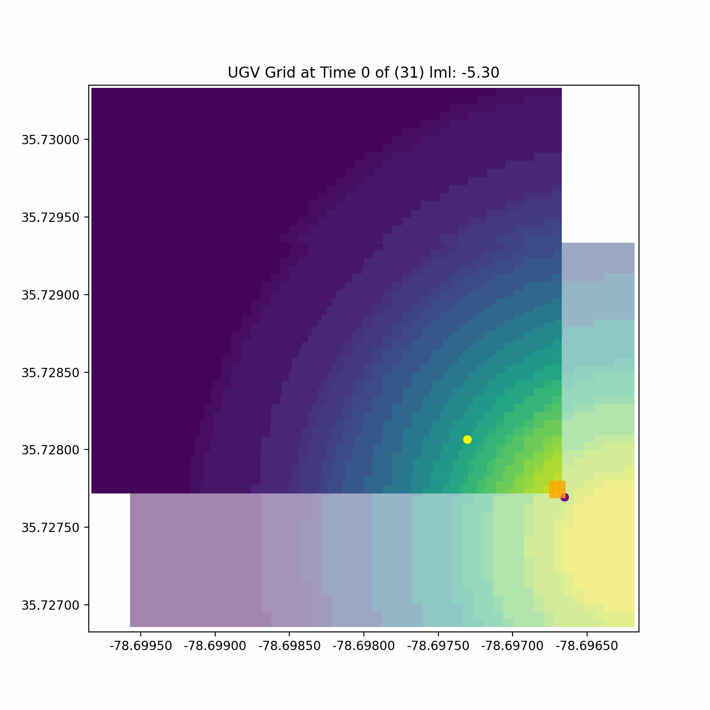
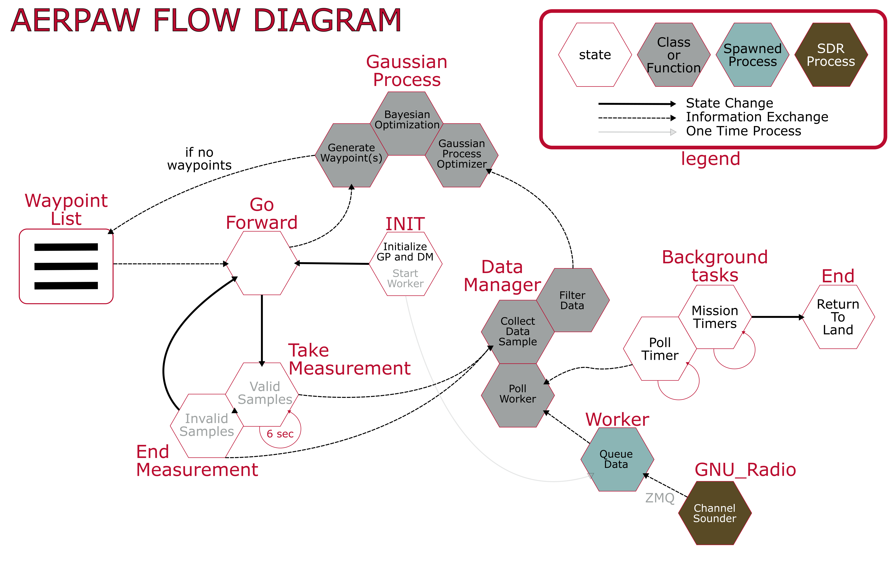

# AERPAW "Find A Rover" Challenge
This repository contains directories which were modified for the code challenge submission.  
More information on the challenge can be found here:  
https://aerpaw.org/  
https://aerpaw.org/aerpaw-afar-challenge/  

<!--  -->

### Project Directory Descriptions
* aerpawlib - holds the main python library which interfaces with the drone
    * This is a bulk inclusion of the aerpawlib library, but there are additions (mostly within utils.py)
* Channel_Sounderv3 - this contains a modified channel sounder gnuradio script given for this competition
    * The modifications only add blocks to the original script and do not impede the original function
* RoverSearch - this is the main code run by the drone
* RoverSearch_OG - this is a backup of the default AERPAW state-machine base code

### Auxillary Directory Descriptions
* aerpaw_vis - this code is used to visualize the drone navigation as a post-processing of pickle files saved during the simulation or flight
* aerpaw_vis_final - this is code softly modified to show final results

### Program Overview
<!--  -->
